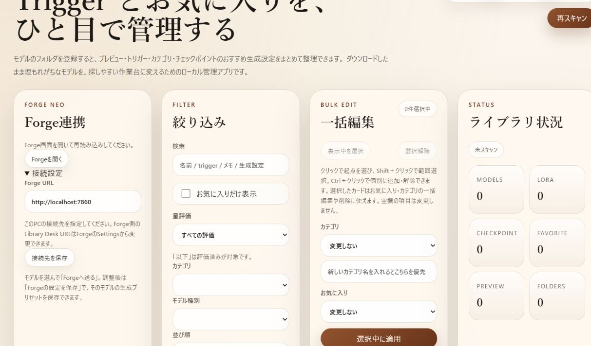

# LoRA Library Desk

Local LoRA/checkpoint library with a Chrome download bridge and per-model Forge Neo generation settings.

**Windows向け試用版 / 0.1.0-alpha.2 / MIT**

LoRA・チェックポイント・Embedding・ComfyUI Workflowを、プレビュー・Trigger・カテゴリ・星評価・メモで整理するローカルアプリです。モデルのフォルダを登録して使います。

## 必要なもの

- Windows 10/11、Python 3.10以上（本体は標準ライブラリのみ。pipインストール不要）
- Chrome/Chromium系ブラウザ（Chrome拡張を使う場合）
- Forge Neo（生成設定の連携を使う場合）

モデルファイル・画像・Python・Forgeは同梱しません。

## 起動

1. [Releases](https://github.com/gariyou/lora-library-desk/releases)からZIPをダウンロードし、書き込み可能なフォルダへ展開します。
2. `start.bat`をダブルクリックします。Pythonが見つからなければPython公式インストーラーで導入してください。
3. `http://127.0.0.1:8787/lora`が開きます。管理するモデルのフォルダを登録してください。

手動起動：`py -3 server.py`。停止は起動した端末で`Ctrl+C`です。
ポート変更：`py -3 server.py --port 8877`。既に使われているポートのプロセスは自動停止しません。

管理データは展開先の`data/`に初回起動時から保存されます。更新時はアプリを停止し、`data/`をバックアップして残したままプログラムを置き換えてください。保存済みのパスが変わると別モデルとして扱われます。

## Chrome拡張：LoRA Manager Bridge

1. `chrome://extensions`で「デベロッパーモード」をオンにします。
2. 「パッケージ化されていない拡張機能を読み込む」で、このZIP内の`chrome_extension/`を選びます。
3. 本体を起動し、watchフォルダを登録します。拡張の接続先は本体と同じURLにします。
4. Civitaiのモデル配布ページで候補・保存先を確認し、Civitai側の通常ダウンロードを行います。拡張がChromeのダウンロード完了を照合して登録フォルダへ取り込みます。ページを開くと先頭候補で自動待機するため、別候補を使う場合は先に待機を解除してください。

ページ情報だけ送信することもできます。画像ページでは生成情報の取得に対応しています。
認証・有料モデルの購入や権限の取得は行いません。

拡張のIDは`manifest.json`の`key`で`cmfddaijajbljjdalpabmocolipfkafj`に固定されており、本体はこのIDの拡張からの通信だけを受け付けます（ほかの拡張からは本体のAPIを呼べません）。0.1.0-alpha.1から更新した場合は、`chrome://extensions`で旧版を削除してから読み込み直し、拡張の接続先URLを設定し直してください。拡張を改造して`key`を変えた場合は、本体を`--extension-id <ID>`付きで起動するか、環境変数`LIBRARY_DESK_EXTENSION_IDS`にIDを指定します。

拡張から本体を起動したい場合だけ、`register_lora_manager_protocol.bat`を実行します。これは現在のユーザーの`lora-manager://`ハンドラーを登録します。通常利用には不要です。

## Forge連携

[Forge Library Desk Bridge](https://github.com/gariyou/sd-forge-library-desk-bridge)をForgeへ導入してください。手動導入用コピーはこのZIPの`forge_bridge/`にもあります。

- Forge画面とLibrary Deskを両方開きます。
- Forgeのtxt2img、Generate下の「現在の設定をLibrary Deskへ保存」で、選択中のチェックポイントに設定を保存します。本体側の「Forgeの設定を保存」でも保存できます。
- 本体でチェックポイントを選び「Forgeへ送る」で内容を確認して復元します。LoRAではタグとTriggerをPromptへ追加します。
- 参考画像の詳細で「SDへ送る」を押すと、現在Forgeで選択しているモデルへ、保存されたPrompt・Negative Prompt・Step・Sampler・Scheduler・CFG・Seed・幅・高さをワンクリックで反映します。記録のない項目は現在の設定を使い、未対応の値は通知します。
- Step、Sampler、Scheduler、CFG、サイズ、Seed、Prompt、Negative Prompt、Hires、Refiner、拡張機能の数値・文字・選択設定、生成関連オプション、外部VAE／エンコーダーをモデル別に保存します。外部モジュールの未選択も保存できます。
- 画像生成は開始しません。ControlNet等の入力画像そのもの、img2img、実行中ジョブは保存対象外です。拡張構成やモデル／モジュールが異なる場合は復元を拒否します。

接続先の初期値はForge=`http://127.0.0.1:7860`、本体=`http://127.0.0.1:8787`です。本体の「Forge連携→接続設定」でForge URLを変更できます。Forge側の`Settings→Library Desk`で本体のURLを変更し、Apply settings→Reload UIでリンクも更新してください。Chrome拡張にも同じ本体URLを設定します。Forge連携の接続先は同じPCのHTTPループバックURLに限ります。

## 同じLAN内の別端末から使う（任意）

`py -3 server.py --lan`で起動すると、同じネットワークのスマホなどから開けます。この場合、PC以外からのアクセスにはアクセス用トークンが必要です。起動時の端末に表示される`?token=...`付きのURLを、最初に一度だけ開いてください（以後はブラウザのCookieで認証されます）。

- トークンは`data/lan-token.txt`に保存され、再起動しても変わりません。漏れた場合は`--reset-lan-token`付きで起動すると作り直せます。
- このURLはパスワードと同じ扱いで、他人に見せないでください。通信は暗号化されないHTTPなので、信頼できる家庭内ネットワークだけで使ってください。
- 同じPC上（127.0.0.1）からのアクセス、Chrome拡張、Forge連携にはトークンは不要です。
- `--host 0.0.0.0`などループバック以外へバインドした場合も同じくトークンが必要になります。

本体は、`localhost`・IPアドレス以外のホスト名で届いたリクエストを拒否します（DNSリバインディング対策）。`mypc.local`などのホスト名で開きたい場合は`--allowed-host mypc.local`を付けて起動してください。

## データと通信

詳細は[PRIVACY.md](PRIVACY.md)。配布物に管理DB・登録フォルダ・モデル・画像・ログ・認証情報は含まれません。起動時のwatchフォルダは空です。

## 対応範囲と開発

WindowsとForge Neo（Neo 2.29.2 / Gradio 4.40.0）で検証しています。A1111、他のForge派生、macOS/Linuxは対応未確認です。公開版の検証内容と限界は[docs/VALIDATION.md](docs/VALIDATION.md)に記載します。

`python -m unittest discover -s tests -p "test_*.py"`

これらのテストはpush・Pull Requestのたびに GitHub Actions（Windows/Ubuntu、Python 3.10/3.14）で自動実行されます。

Node.jsだけで実行できる拡張のテスト：`node --test tests/test_auto_wait.cjs tests/test_auto_recovery.cjs tests/test_download_completion.cjs`

一部のブラウザテストはPlaywrightを必要とします。アプリの通常利用にはNode.jsやPlaywrightは不要です。

MITライセンス。外部プロジェクトの扱いは[THIRD_PARTY_NOTICES.md](THIRD_PARTY_NOTICES.md)。不具合報告ではモデル実体・認証情報・個人プロンプトを添付せず、再現手順とバージョンを記載してください。

## English quick start

Install Python 3.10+, unzip a release, run `start.bat`, then add your model directories at `http://127.0.0.1:8787/lora`. Load `chrome_extension/` as an unpacked Chrome extension. Install the separate Forge bridge to save and restore checkpoint-specific txt2img settings. Windows/Forge Neo only for this preview; generation and model downloads are never started by a settings transfer. The server accepts API calls only from the bundled extension ID and rejects unknown Host names (DNS rebinding protection). With `--lan`, devices other than this PC must open the `?token=...` URL printed at startup. User data lives in `data/` and is excluded from distributions.
